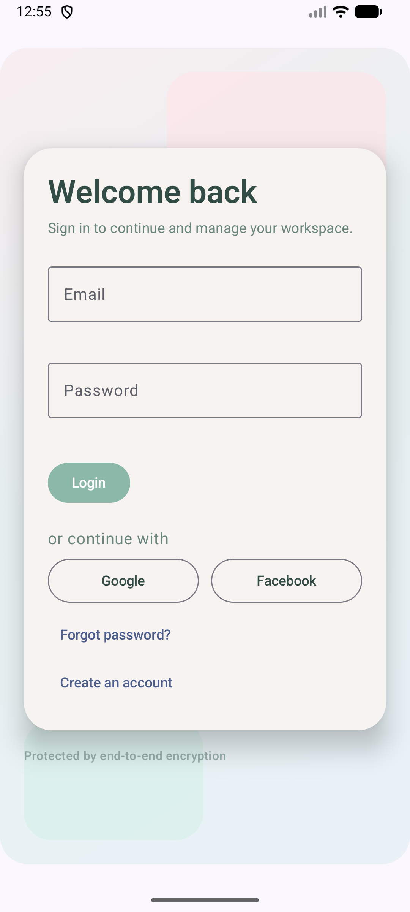
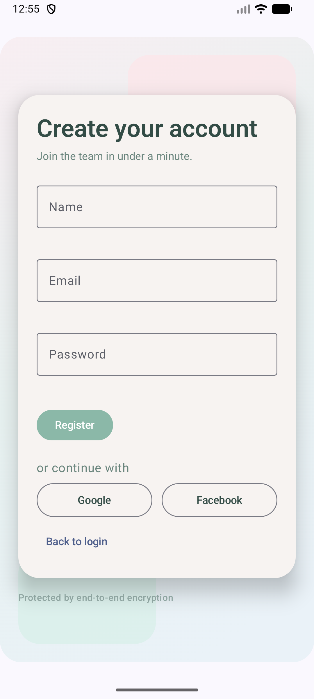

# Authentication Module

A reusable Android authentication feature module built with Jetpack Compose. It provides Login, Register, and Forgot Password screens with a clean architecture foundation, MVVM + MVI state handling, Hilt DI, and ready-to-wire social login buttons (Google/Facebook dummy hooks).

**Project Summary**  
Built a Production‑Ready Android Auth Module (Clean Architecture + MVVM/MVI + Compose + Hilt). I just finished a modular Android authentication feature that can drop into any app. It includes Login/Register/Forgot Password screens, dummy Google/Facebook hooks, and a soft wellness UI in Compose. Architecture is Clean + MVVM + MVI with unidirectional flow and Hilt DI. Tests cover core flows with unit + UI tests and JaCoCo reporting.

**What This Is**
- A drop-in authentication module (`:auth`) you can include in any Android app.
- UI + state management + validation + error handling in a clean, testable structure.
- Social login UI hooks with callbacks (no SDKs yet).

**Tech Stack**
- Kotlin
- Jetpack Compose (Material 3)
- Hilt (DI)
- Coroutines + Flow
- Gradle Version Catalog
- JaCoCo (coverage)

**Libraries Used**
- AndroidX Compose BOM + UI + Material3
- AndroidX Activity Compose
- AndroidX Lifecycle Runtime + ViewModel
- AndroidX Navigation Compose
- Hilt Android + Hilt Navigation Compose
- Kotlin Coroutines
- AndroidX Test (JUnit, Espresso, Compose UI tests)
- JaCoCo

**Architecture & Design Patterns**
- Clean Architecture layers: `data`, `domain`, `presentation`
- MVVM for each screen (Login, Register, Forgot Password)
- MVI-style state + intent + effect per screen
- Unidirectional data flow
- Dependency Injection with Hilt

**Why Clean + MVVM + MVI (And Why Together)**
- **Clean Architecture** keeps business rules independent from UI/frameworks, making the auth logic portable and testable.
- **MVVM** gives each screen its own ViewModel and clear separation between UI and state/logic.
- **MVI** inside each ViewModel makes state changes predictable and traceable (single source of truth + immutable state).
- **Together** this scales better for long-term modules: easier testing, fewer regressions, and clearer ownership of UI vs domain logic.

**MVI Flow (Per Screen)**
1. UI emits `Intent` from user actions (typing, click, submit).
2. ViewModel handles the intent, calls use cases, and reduces `State`.
3. UI renders the latest `State` (inputs, loading, field errors).
4. One-off events are emitted as `Effect` (success message, navigation).

**What Does What**
- `State`: Single source of truth for UI rendering (inputs, errors, loading).
- `Intent`: User actions (e.g., `UpdateEmail`, `Submit`).
- `Effect`: One-time events (e.g., `Authenticated`, `ShowMessage`).
- `ViewModel`: Reducer/handler that maps intents to state + effects.

**Where MVVM Is Used**
- **ViewModels (VM)**  
  - `auth/src/main/java/com/example/auth/presentation/viewmodel/login/LoginViewModel.kt`  
  - `auth/src/main/java/com/example/auth/presentation/viewmodel/register/RegisterViewModel.kt`  
  - `auth/src/main/java/com/example/auth/presentation/viewmodel/forgot/ForgotPasswordViewModel.kt`
- **Views (Compose UI)**  
  - `auth/src/main/java/com/example/auth/presentation/screen/login/LoginRoute.kt`  
  - `auth/src/main/java/com/example/auth/presentation/screen/register/RegisterRoute.kt`  
  - `auth/src/main/java/com/example/auth/presentation/screen/forgot/ForgotPasswordRoute.kt`
- **Models (State/Intent/Effect)**  
  - `auth/src/main/java/com/example/auth/presentation/model/login/*`  
  - `auth/src/main/java/com/example/auth/presentation/model/register/*`  
  - `auth/src/main/java/com/example/auth/presentation/model/forgot/*`

**Module Structure**
- `auth/src/main/java/com/example/auth/data`
- `auth/src/main/java/com/example/auth/domain`
- `auth/src/main/java/com/example/auth/presentation`

**UI/Design**
- Soft pastel wellness theme
- Consistent spacing, text hierarchy, and field-level error display
- Snackbar for success feedback
- Social login UI row (Google/Facebook dummy hooks)

**Testing**
- Unit tests for use cases and ViewModels
- Instrumentation tests for UI flows and edge cases
- JaCoCo reports for coverage

**How To Run Tests**
```bash
./gradlew :auth:test
./gradlew :auth:connectedAndroidTest
./gradlew :auth:jacocoTestReport
```

**Coverage Reports**
- `auth/build/reports/jacoco/jacocoTestReport/html/index.html`
- `auth/build/reports/coverage/androidTest/debug/connected/index.html`


**Screenshots**

Login



Register



**Usage (Host App)**
Add the module and include the navigation graph (recommended):

```kotlin
AuthNavGraph(
    navController = navController,
    onAuthSuccess = { userId -> /* handle success */ },
    onPasswordResetSent = { /* handle reset */ },
    onGoogleLogin = { /* integrate Google SDK later */ },
    onFacebookLogin = { /* integrate Facebook SDK later */ }
)
```


If you want publishing, SDK integrations, or theme customization, this module is ready to extend.
